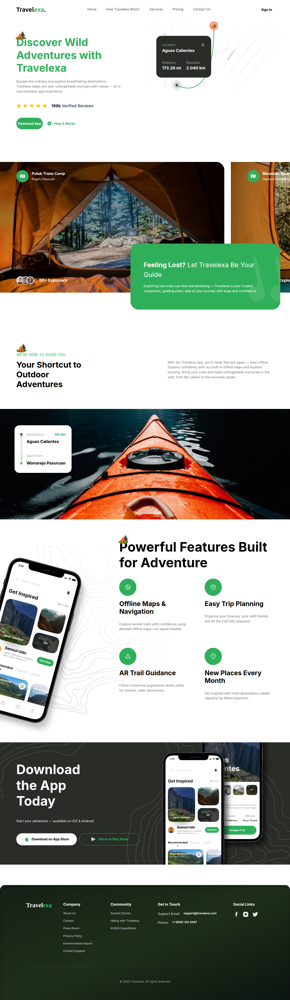

<div align="center">
  <br />
  <div>
    
    
    
  </div>

  <h3 align="center">🌍 Travelexa – Modern Travel Landing Page</h3>
  <p>Adventure-ready landing UI built with Next.js 13, Tailwind CSS, and TypeScript</p>

  <br />

  
</div>

## 🚀 Overview

**Travelexa** is a sleek, responsive, and animation-rich travel landing page crafted with the latest frontend stack. It features reusable components, Framer Motion animations, and a clean, professional layout built for performance.

---

## 🧱 Tech Stack

- **Next.js 14** – React-based modern framework
- **Tailwind CSS** – Utility-first CSS framework
- **TypeScript** – Type-safe codebase for maintainability
- **Framer Motion** – Smooth animations and transitions

---

## ✨ Features

- 🎯 **Hero Section** – Eye-catching with call-to-action
- 🏕️ **Camp Explorer** – Showcase different camp areas
- 📖 **Travel Guide** – Informative section for explorers
- 📱 **Mobile App CTA** – Buttons for app store downloads
- 🧭 **Footer** – Animated social icons & structured info

---

## ⚡ Getting Started

### Prerequisites

Make sure the following are installed:

- Git
- Node.js (v18+)
- npm

### Clone & Install

```bash
git clone https://github.com/Kamran0925/travelexa.git
cd travelexa
npm install
```

### Run Locally

```bash
npm run dev
```

Then open [http://localhost:3000](http://localhost:3000) in your browser.

---

> **Built with ❤️ by Kamran Rizwan – Frontend Developer**
